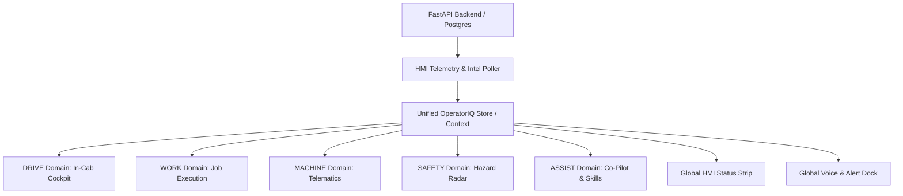

# CAT OperatorIQ — In-Cab Heavy-Equipment HMI Architecture Specification

**Document Version:** 1.0.0  
**Phase:** Phase 1 — Frontend Architecture Preparation  
**Target Platform:** Heavy Machinery In-Cab Touchscreen HMI (Ruggedized, Glanceable, High-Contrast)  
**Reference Codebase:** CAT OperatorIQ v0.0.0  

---

## 1. Executive Summary & Paradigm Shift

**CAT OperatorIQ** is transitioning from a conventional desktop/web dashboard layout (sidebar navigation, dense multi-card grids, text-heavy desktop tables) into a **production-grade In-Cab Heavy-Equipment Human-Machine Interface (HMI)**.

### The In-Cab Operating Environment
Operating heavy equipment (excavators, wheel loaders, dozers, articulated haulers) imposes distinct ergonomic and cognitive requirements:
- **Glanceability:** The operator's primary visual focus is on the job site, bucket/implement, trench, and surrounding ground personnel. Screen glances typically last 0.5 to 1.5 seconds.
- **Physical Controls & Glove Compatibility:** Touch targets must be substantial (minimum 48–64px hit areas), high-contrast, and spaced to prevent accidental actuation while wearing heavy work gloves or operating under cab vibration.
- **Unified Operational Context:** The interface is not five disparate apps, but **five specialized optical lenses into one coherent, real-time machine/operator operational state**.

---

## 2. The Five HMI Operational Domains

```
+===================================================================================================+
|                                    SHARED IN-CAB TOPBAR / STATUS STRIP                            |
| Machine: M0001 (CAT 320) | Op: Alex Morgan (OP0001) | Safety: SAFE | Network: ONLINE | 10:42 AM   |
+===================================================================================================+
| [ DRIVE ]        | [ WORK ]        | [ MACHINE ]     | [ SAFETY ]      | [ ASSIST ]               |
| Primary In-Cab   | Job Execution   | Telematics &    | Hazard Radar,   | AI Assistant, Training,  |
| Operating Screen | & Task Queue    | Equipment Health| Alerts & Events | Shift Debrief & Insights |
+------------------+-----------------+-----------------+-----------------+--------------------------+
| • Speed & RPM    | • Active Task   | • 6 Live Gauges | • 360° Radar    | • Voice STT/TTS Chat     |
| • Engine Load %  | • Task Schedule | • Anomaly Score | • Proximity Pts | • AI Insights Feed       |
| • Fuel Rate/Lvl  | • ETA Variance  | • Diagnostics   | • Active Alerts | • Skill Progression Hub  |
| • Active Task    | • Completion %  | • Fuel Baseline | • Incident Log  | • Shift Debrief Summary  |
| • Safety Status  | • Schedule List | • History Trend | • Event History | • AI Shift Optimization |
+===================================================================================================+
|                               PERSISTENT BOTTOM HMI DOCK / DRAWER TRIGGER                         |
| [ Voice Mic ] [ Quick Ask Assist ] [ Active Alarm Banner ] [ Direct Incident Log Shortcut ]      |
+===================================================================================================+
```

---

## 3. Section A: Existing Route → New HMI Domain Mapping

The table below maps all 8 existing React Router routes to the new 5-Domain In-Cab HMI architecture. **No existing route or capability is deleted**; instead, they are reorganized into logical in-cab views.

| Existing Route | Existing Page Component | Primary Functionality Today | New HMI Domain | Architectural Role in New HMI |
| :--- | :--- | :--- | :--- | :--- |
| `/` | `CommandCenter.tsx` | Fleet summary metrics, active machine card, current task card, safety summary, AI preview, task timeline, quick action buttons. | **DRIVE** (Redistributed) | **Core operational telemetry & current task elements form the primary DRIVE view.** Fleet supervisor-level aggregates (e.g. Total Active Fleet Machines, Active Operators) are relocated to supervisor sub-panels or the Assist/Shift debrief. |
| `/operator` | `OperatorView.tsx` | Operator cockpit: shift hours, safety status, task ETA, machine anomaly score, fuel efficiency deviation, AI insights banner. | **DRIVE** (Merged with Cockpit Core) | Forms the foundational data model for the **DRIVE** home screen. Merges machine health, task ETA variance, and safety posture into a single glanceable instrument panel. |
| `/tasks` | `Tasks.tsx` | Task schedule table, status filters (Total, In Progress, Upcoming, Completed), TaskDetailPanel, efficiency progress, and AI ETA prediction. | **WORK** | Serves as the dedicated **WORK** domain. Features an in-cab touch-optimized schedule list, implementation details, target material quantities, and dynamic ETA variance tracking. |
| `/machine` | `Machine.tsx` | Live telemetry cards (RPM, Load, Pressure, Coolant, Fuel, Speed), 3 Recharts history trends (RPM, Fuel, Load), machine specs. | **MACHINE** | Serves as the dedicated **MACHINE** domain. Features high-visibility analog/digital instrument clusters, sensor limit warnings, anomaly diagnostics, and historical trend inspection. |
| `/safety` | `Safety.tsx` | Proximity radar monitor, sensor distance pills, overall safety status banner, incident reporting modal, active alerts, and event history log. | **SAFETY** | Serves as the dedicated **SAFETY** domain. Features the 360-degree spatial hazard radar, proximity threshold alerts, active interlocks, incident logging, and safety event auditing. |
| `/insights` | `AIInsights.tsx` | Categorized intelligence feed (Safety, Productivity, Fuel, Behavior), severity counters (Warning, Critical, Info), category filters. | **ASSIST** (Tab: Insights) | Forms the **Operational Insights** view inside **ASSIST**, clustering automated ML detections and recommended operator interventions. |
| `/training` | `Training.tsx` | Operator training hub, overall progress bar, recommended modules with trigger reasons, all modules grid, module preview modal. | **ASSIST** (Tab: Training) | Forms the **Operator Academy / Skill Progress** view inside **ASSIST**, allowing operators to review assigned safety/efficiency micro-modules during idle periods or pre-shift. |
| `/shift-report` | `ShiftReport.tsx` | Shift debrief, 6 KPI cards, Task Duration Comparison bar chart, Hourly Fuel burn line chart with baseline, task variance table, AI recommendation. | **ASSIST** (Tab: Shift Debrief) | Forms the **Shift Debrief & Performance Review** view inside **ASSIST**, accessible at the end of the shift or on-demand to analyze productivity and idle fuel waste. |

---

## 4. Section B: Existing Component → New Component / Domain Mapping

Every existing React component in `src/components/` and page-internal components are accounted for and mapped to their target in the HMI architecture:

| Existing Component | Current File Location | Current Responsibilities | Target HMI Domain | Target HMI Component / Pattern |
| :--- | :--- | :--- | :--- | :--- |
| `AppLayout` | `src/components/layout/AppLayout.tsx` | Top-level flex shell, mobile overlay, sidebar wrapper, `<Outlet />`, floating assistant trigger. | **GLOBAL SHELL** | `InCabShell` — Rugged frame with persistent top telemetry strip, bottom glove-friendly primary domain switcher, and emergency alert HUD overlay. |
| `Sidebar` | `src/components/layout/Sidebar.tsx` | 240px/64px collapsible left bar with 8 vertical links, operator profile, and machine connection badge. | **GLOBAL SHELL** | `HmiPrimaryDock` — Replaced with an industrial high-contrast navigation bar (horizontal bottom dock or vertical left tactical rail) featuring 5 large touch buttons: DRIVE, WORK, MACHINE, SAFETY, ASSIST. |
| `Topbar` | `src/components/layout/Topbar.tsx` | Route title, date, clock, mobile menu button, notification bell with unread dot. | **GLOBAL SHELL** | `HmiTopStatusBar` — High-glanceability instrument strip showing Machine ID & Model, Operator Identity, Global Safety Pill, Network Connectivity, Shift Clock, and Master Caution/Warning indicators. |
| `Card`, `CardHeader`, `Section` | `src/components/common/Card.tsx` | Standard SaaS styled card container with borders and padding. | **SHARED PRIMITIVES** | `HmiPanel`, `HmiInstrumentBezel` — Re-engineered with heavy industrial bezels, tactile borders, high-contrast surface tokens, and touch-state feedback. |
| `Modal` | `src/components/common/Modal.tsx` | Standard centered dialog overlay with close `X`. | **SHARED PRIMITIVES** | `HmiModalDialog` — Large full-screen or prominent drawer overlay designed for glove actuation with prominent dismiss buttons. |
| `StatusBadge`, `TaskStatusBadge`, `SeverityBadge` | `src/components/common/StatusBadge.tsx` | Small inline pill badges with colored dots. | **SHARED PRIMITIVES** | `HmiStatusIndicator`, `HmiTelltale` — ISO-standard industrial telltales and high-contrast status tags (green/amber/red). |
| `MachineCard` | `src/components/dashboard/MachineCard.tsx` | Displays machine model, ID, operating status, engine hours, and age. | **DRIVE** & **MACHINE** | `MachineIdentityBezel` — Integrated into DRIVE header and MACHINE specs header with prominent engine hours counter. |
| `CurrentTaskCard` | `src/components/dashboard/CurrentTaskCard.tsx` | In-progress task title, site zone, efficiency progress bar, scheduled vs AI predicted duration, delay variance. | **DRIVE** & **WORK** | `ActiveTaskGauge` — Prominent circular/horizontal task completion gauge on DRIVE; master task header on WORK. |
| `MetricCard` | `src/components/dashboard/MetricCard.tsx` | KPI metric with semantic left border accent, value, trend indicator. | **DRIVE**, **WORK**, **ASSIST** | `HmiMetricReadout` — Industrial digital readout with high-contrast font, engineering unit labels, and threshold colored borders. |
| `SafetyStatusCard` | `src/components/dashboard/SafetyStatusCard.tsx` | Seatbelt, nearest person, obstacle, movement status grid, and link to `/safety`. | **DRIVE** | `SafetyQuickCheck` — Glanceable telltale row on the DRIVE screen indicating seatbelt lock, obstacle proximity warning, and reverse interlock. |
| `AIInsightCard` | `src/components/dashboard/AIInsightCard.tsx` | Soil moisture impact demo preview and factor breakdown. | **DRIVE** & **ASSIST** | `ContextualInsightPill` on DRIVE; expanded detail card within ASSIST feed. |
| `TaskTimeline` | `src/components/dashboard/TaskTimeline.tsx` | Vertical 4-item task timeline with colored status dots. | **WORK** | `WorkShiftTimeline` — Horizontal or vertical industrial timeline in WORK showing current shift progress and upcoming dispatches. |
| `AIAssistant` | `src/components/assistant/AIAssistant.tsx` | Floating action button, expandable 384x500px chat box, Web Speech recognition, SpeechSynthesis, suggested prompt chips. | **ASSIST** & **GLOBAL DOCK** | `InCabVoiceCoPilot` — Available persistently via a global voice actuation trigger on the bottom dock, and embedded as a full-featured conversational view in ASSIST. |
| `TaskDetailPanel` | `src/pages/Tasks.tsx` | Detailed task specs, efficiency progress bar, and AI ETA prediction delta. | **WORK** | `TaskExecutionInspector` — Slide-over or split-screen detail view in WORK with direct action triggers ("Mark Complete", "Request Assistance"). |
| `ProximityMap` & `ProximityIndicator` | `src/pages/Safety.tsx` | Concentric radar rings, relative machine position, 3 proximity targets (Worker, Haul Truck, Edge), status badges. | **SAFETY** & **DRIVE** | `HazardRadarWidget` — Full interactive radar in SAFETY; miniaturized perimeter proximity indicator on DRIVE. |
| `IncidentModal` | `src/pages/Safety.tsx` | Incident filing form (Type, Severity, Location, Description) and submission state. | **SAFETY** & **GLOBAL** | `QuickIncidentLogger` — Large-target quick filing wizard accessible from SAFETY and the DRIVE emergency action button. |
| `InsightCard` | `src/pages/AIInsights.tsx` | Categorized recommendation card with severity badge, metrics, and recommendation text. | **ASSIST** | `OperationalInsightCard` — Touch-optimized card with clear iconology, impact rating, and "Apply Recommendation" / "Ask Co-Pilot" actions. |
| `ModuleCard` & `TrainingPreviewModal` | `src/pages/Training.tsx` | Training module card with difficulty, category, recommendation reason, and syllabus preview modal. | **ASSIST** | `TrainingCourseCard` & `TrainingLessonViewer` — In-cab micro-learning viewer within the ASSIST training section. |
| `KPICard` & `ChartTooltipCustom` | `src/pages/ShiftReport.tsx` | Shift performance metrics and custom Recharts tooltip. | **ASSIST** | `ShiftPerformanceKpi` & `HmiChartInspector` — End-of-shift reporting widgets within ASSIST. |
| `TelCard` & `ChartTooltip` | `src/pages/Machine.tsx` | 6 telemetry cards with warning/critical borders; time-series chart tooltips. | **MACHINE** | `TelemetryInstrumentBezel` — Analog/digital gauge cluster with dynamic needle/bar meters and warning threshold flashing. |

---

## 5. Section C: Existing API → HMI Feature Mapping

The frontend currently utilizes 22 API endpoints defined in `src/api/client.ts` and FastAPI routes in `backend/app/routes/`. The table below establishes their exact consumer, target HMI domain, data displayed, and operational purpose:

| HTTP Method | API Endpoint | Existing Frontend Consumer | Target HMI Domain | Data Attributes Returned & Displayed | Operational Purpose in New HMI |
| :--- | :--- | :--- | :--- | :--- | :--- |
| `GET` | `/api/dashboard/summary` | `CommandCenter.tsx` | **DRIVE** & **ASSIST** | `active_machines`, `active_operators`, `pending_tasks`, `active_alerts` | Supplies fleet-wide overview counters. Used in DRIVE status strip and ASSIST shift overview. |
| `GET` | `/api/operator/{id}/dashboard` | `OperatorView.tsx`, `Sidebar.tsx` | **GLOBAL SHELL**, **DRIVE** | Operator record (`name`, `id`, `skill_level`, `shift_hours_logged`), tasks array, safety events array, training progress | Establishes authenticated operator identity, cumulative shift hours, and active work orders. |
| `GET` | `/api/machines` | `Sidebar`, `CommandCenter`, `Machine`, `Tasks`, `Safety` | **GLOBAL SHELL**, **MACHINE** | List of `Machine` records (`machine_id`, `machine_model`, `machine_type`, `status`, `operating_weight_kg`) | Populates machine selector, equipment specifications, and telemetry binding. |
| `GET` | `/api/machines/{id}` | `Sidebar.tsx`, `CommandCenter.tsx` | **MACHINE**, **DRIVE** | Single `Machine` details (`machine_id`, `engine_type`, `rated_power_kw`, `fuel_capacity_l`, `status`) | Provides authoritative equipment specs for the currently mounted machine. |
| `GET` | `/api/operators` | All pages (fetches initial operator) | **GLOBAL SHELL** | List of `Operator` records (`operator_id`, `operator_name`, `skill_level`, `safety_score`, `training_score`) | Supplies active operator identity and operator profile attributes. |
| `GET` | `/api/operators/{id}` | Optional single operator query | **GLOBAL SHELL** | Single `Operator` record | Deep operator credential and scoring inspection. |
| `GET` | `/api/tasks` | `CommandCenter`, `Tasks`, `ShiftReport`, `Sidebar` | **WORK**, **DRIVE**, **ASSIST** | List of `Task` records (`task_id`, `task_type`, `task_status`, `scheduled_start`, `estimated_duration_min`, `task_efficiency`) | Drives the active task on DRIVE, the full work schedule on WORK, and shift completion in ASSIST. |
| `GET` | `/api/tasks/{id}` | Detail task lookup | **WORK** | Single `Task` record | Displays comprehensive work order parameters and material density. |
| `GET` | `/api/daily-tasks` | `client.ts` (Backend route `/api/daily-tasks`) | **WORK** | List of `DailyTask` dispatches (`date`, `priority`, `location_zone`, `target_quantity`, `status`) | Provides site-level daily dispatch sequence and location zone tracking. |
| `GET` | `/api/safety/events` | `Safety.tsx` | **SAFETY** | List of `SafetyEvent` records (`event_id`, `event_type`, `severity`, `distance_to_person_m`, `seatbelt_status`, `resolved`) | Populates the Safety Event Log and feeds safety history auditing. |
| `GET` | `/api/telemetry/{id}` | `Machine.tsx` | **DRIVE**, **MACHINE** | Array of `Telemetry` points (`engine_rpm`, `engine_load_percent`, `hydraulic_pressure_bar`, `coolant_temperature_c`, `fuel_rate_lph`, `machine_speed_kmh`) | Drives the live telemetry instrument cluster and Recharts historical trend lines. |
| `GET` | `/api/fuel/{id}` | `client.ts` (Available on backend) | **MACHINE**, **DRIVE** | Array of `FuelUsage` records (`fuel_rate_lph`, `operating_hours`, `idle_hours`, `idle_fuel_l`, `expected_fuel_rate_lph`) | Powers the fuel efficiency meter, idle burn tracking, and consumption graphs. |
| `GET` | `/api/alerts` | `Safety.tsx`, `CommandCenter.tsx` | **SAFETY**, **DRIVE**, **GLOBAL** | List of `Alert` records (`alert_id`, `alert_type`, `severity`, `message`, `recommended_action`, `resolved`) | Surfaces active master warnings, engine threshold alarms, and safety protocol alerts. |
| `GET` | `/api/training/modules` | `Training.tsx` | **ASSIST** | List of `TrainingModule` records (`training_id`, `title`, `category`, `difficulty`, `duration_min`, `description`) | Populates the training curriculum catalog. |
| `GET` | `/api/training/progress/{id}`| `Training.tsx` | **ASSIST** | List of `TrainingProgress` records (`training_id`, `status`, `score`, `reason_recommended`) | Tracks operator module completion, scores, and AI recommendations. |
| `POST` | `/api/intelligence/task-eta`| `CurrentTaskCard`, `Tasks.tsx` | **WORK**, **DRIVE** | Payload: `{ task_id }`. Returns: `{ task_id, estimated_duration_min, predicted_duration_min, delay_minutes, status }` | ML RandomForest inference estimating task completion and schedule delay variance. |
| `GET` | `/api/intelligence/fuel/{id}`| `client.ts` (Used in unified intel) | **MACHINE**, **DRIVE** | `{ machine_id, actual_fuel_rate, expected_fuel_rate, deviation_percent, status, idle_fuel }` | Deterministic comparative baseline analysis detecting abnormal fuel burn rates. |
| `GET` | `/api/intelligence/safety/{id}`| `Safety.tsx` | **SAFETY**, **DRIVE** | `{ operator_id, risk_score, risk_level, factors: [...], recommendation }` | Behavioral risk scoring algorithm evaluating proximity and compliance events. |
| `GET` | `/api/intelligence/operator/{id}`| `OperatorView`, `AIInsights`, `ShiftReport` | **DRIVE**, **ASSIST** | Unified payload combining Task ETA, Machine Health, Fuel Deviation, Safety Risk, and natural language `insights` array | Serves as the master real-time operational context provider for in-cab AI co-pilot. |
| `POST` | `/api/assistant/chat` | `AIAssistant.tsx` | **ASSIST**, **GLOBAL DOCK** | Payload: `{ message, operator_id }`. Returns: `{ response, sources: [...] }` | Conversational LLM endpoint providing context-grounded operator assistance. |
| `GET` | `/health` | `main.py` | **GLOBAL STATUS** | `{ status: "healthy", database: "connected" }` | Infrastructure health check for network/database connectivity status strip. |
| `GET` | `/` | `main.py` | **SYSTEM** | Welcome metadata | API verification. |

---

## 6. Section D: Existing ML Capability → HMI Location & Integration

The four machine learning and predictive analytics services are mapped to their specific tactile locations in the In-Cab HMI:

```
+---------------------------------------------------------------------------------------------------+
| PREDICTIVE ML CAPABILITY         | ALGORITHM / ENGINE           | TARGET HMI LOCATION & PRESENTATION |
+----------------------------------+------------------------------+------------------------------------+
| 1. Task ETA & Delay Variance     | RandomForestRegressor (50 tr)| WORK: Master Task Progress Gauge   |
|                                  | Features: task_type, machine,| DRIVE: Secondary Variance Badge    |
|                                  | operator_skill, target_qty   | Presentation: Glanceable delta     |
|                                  |                              | (e.g. "+15m DELAY" in Amber)       |
+----------------------------------+------------------------------+------------------------------------+
| 2. Machine Anomaly Detection     | IsolationForest (Contam 0.05)| MACHINE: Instrument Health Gauge   |
|                                  | Features: RPM, Load %, Speed,| DRIVE: Telltale Anomaly Warning    |
|                                  | Fuel Rate. Rule signature eng| Presentation: Anomaly Score (0-1)  |
|                                  |                              | & Signatures ("High Engine Load")  |
+----------------------------------+------------------------------+------------------------------------+
| 3. Fuel Anomaly & Idle Waste     | Historical Median Baseline   | MACHINE: Fuel Burn Diagnostics     |
|                                  | Comparison over FuelUsage DB | DRIVE: Fuel Economy Pill           |
|                                  |                              | Presentation: % above expected &   |
|                                  |                              | Idle Fuel Wasted (Liters)          |
+----------------------------------+------------------------------+------------------------------------+
| 4. Behavioral Safety Risk Score  | Weighted Risk Rule Engine    | SAFETY: Master Hazard Shield       |
|                                  | Inputs: Proximity, Seatbelt, | DRIVE: Safety State Header Pill    |
|                                  | Hard Braking, Acceleration   | Presentation: "SAFE" / "CAUTION" /  |
|                                  |                              | "HIGH RISK" + Factor Tags          |
+---------------------------------------------------------------------------------------------------+
```

---

## 7. Section E: Existing AI Capability → HMI Location & Cross-Domain Triggers

### 7.1 Central Assistant Location
- **ASSIST Domain:** Full-screen dedicated conversational workspace featuring full scrollable chat history, operator intelligence context inspector, and micro-training integration.
- **Global In-Cab Dock:** Persistent microphone actuation button on the bottom tactile bar. Pressing the mic button opens the voice interaction overlay from **any screen without navigating away**.

### 7.2 Cross-Domain Contextual AI Triggers
In an in-cab environment, the operator should not need to navigate away from their active task to benefit from AI assistance. The architecture defines contextual quick-actions:

```
+------------------+-----------------------------------------------+----------------------------------------+
| HMI Domain       | Operational Anomaly Detected                  | Contextual AI Trigger Action           |
+------------------+-----------------------------------------------+----------------------------------------+
| **DRIVE**        | Active Task trending 15 min behind schedule   | Quick Pill: [ Ask Assist: "Why behind schedule?" ] |
| **DRIVE**        | Safety Risk switches to "CAUTION"             | Quick Pill: [ Ask Assist: "What triggered risk?" ] |
| **WORK**         | Work efficiency drops below 60%               | Action Button: [ "Optimize Cycle Time" -> Assist ] |
| **MACHINE**      | IsolationForest flags "High Engine Load"      | Diagnostic Pill: [ "Explain Signature" -> Assist ] |
| **MACHINE**      | Fuel consumption 18% above baseline           | Action: [ "Suggest Idle Reduction Protocol" ]      |
| **SAFETY**       | Proximity event recorded (Worker at 4.2m)     | Action: [ "Review Proximity Protocol" -> Assist ]  |
+------------------+-----------------------------------------------+----------------------------------------+
```

---

## 8. Section F: Cross-Cutting Shared Operational Context

To guarantee that the five HMI domains stay synchronized without redundant API fetches or state divergence, the frontend architecture relies on a centralized **Operational Context Provider**:



### Core State Slices
1. **Operator Identity Slice:** `operator_id`, `operator_name`, `skill_level`, `shift_hours_logged`, `safety_score`.
2. **Machine Telematics Slice:** `machine_id`, `machine_model`, `operating_state`, live sensor stream (`rpm`, `load`, `pressure`, `temp`, `fuel`, `speed`), and historical buffer (15–50 points).
3. **Task & Operation Slice:** Active work order, completed count, queue of scheduled daily tasks, efficiency progress, and RandomForest ETA variance.
4. **Safety & Hazard Slice:** Current risk classification (`low`, `moderate`, `high`, `critical`), simulated radar targets, active alarms, and event buffer.
5. **AI Intelligence Slice:** Unified intelligence payload (`insights` array, anomaly signatures, fuel deviation %, safety recommendations).
6. **Conversational Assistant Slice:** Dialogue history, STT recording status (`isListening`), audio TTS playback status, suggested quick actions.

---

## 9. Section G: Unmapped Functionality & Special Accommodations

### 1. Fleet Supervisor Aggregates (from `CommandCenter.tsx`)
- **Current State:** The current dashboard features supervisor-level counters: *Active Machines (42 Deployed)* and *Active Operators (18 On Shift)*.
- **In-Cab Context:** An individual machine operator in the cab typically prioritizes their own machine and immediate zone rather than global fleet headcounts.
- **Architectural Solution:** These metrics will be preserved in a dedicated **"Fleet / Shift Roster"** sub-panel accessible within the ASSIST/Shift Debrief section, ensuring 0% loss of functionality while keeping DRIVE strictly focused on operator safety and execution.

### 2. Incident Submission Form (from `Safety.tsx`)
- **Current State:** The incident submission form currently logs to local React state without an explicit `POST /api/incidents` backend endpoint.
- **Architectural Solution:** The HMI will preserve the exact form fields (`type`, `severity`, `location`, `description`) and submission feedback within `QuickIncidentLogger`. A client-side store will persist logged incidents into the session history so operators can review their reported near-misses.

### 3. Training Module Enrollment
- **Current State:** Clicking "Start Training" currently triggers a console log and dismisses the preview modal.
- **Architectural Solution:** The HMI will retain the full modal preview syllabus, difficulty rating, and recommendation trigger reason, adding local session progress tracking so modules can transition from `not-started` to `in-progress` and `completed`.

---

## 10. Section H: Technical & Architectural Risk Assessment

| Risk Area | Description | Severity | Mitigation Strategy for Implementation Phase |
| :--- | :--- | :--- | :--- |
| **1. LLM Model Parameter Configuration** | In `backend/app/routes/assistant.py` (line 73), model is set to `openai/gpt-oss-20b`. Uvicorn logs demonstrated HTTP 500 errors when communicating with Groq. | **High** | Ensure the Groq chat completion request targets a valid supported model identifier (e.g. `llama-3.3-70b-versatile` or `mixtral-8x7b-32768`) in the backend without changing API contracts. |
| **2. High-Frequency Telemetry Rendering** | Telemetry charts re-rendering high-frequency IoT readings on low-power in-cab touch displays can cause UI stutter. | **Medium** | Use memoized subcomponents (`React.memo`), throttled canvas/SVG rendering, and decoupled telemetry buffers. |
| **3. Web Speech API Browser Compatibility** | `webkitSpeechRecognition` requires active microphone permissions and Chromium-based browser engine. | **Medium** | Graceful fallback to touch quick-action chips and on-screen keyboard input when microphone is denied or unavailable. |
| **4. Glanceability vs Information Density** | Heavy equipment HMI standards require high contrast and minimum font scales (>= 14-16px for body, >= 24-32px for primary gauges). | **Medium** | Eliminate decorative card margins and nested padding in favor of industrial bezel frames and large-format numeric readouts. |

---

## Architectural Sign-Off
This architectural specification establishes the authoritative blueprint for transitioning **CAT OperatorIQ** into an industrial in-cab heavy-equipment HMI. All existing APIs, machine learning pipelines, database models, conversational capabilities, and operational data flows are fully accounted for and mapped into the 5 core domains: **DRIVE, WORK, MACHINE, SAFETY, and ASSIST**.
